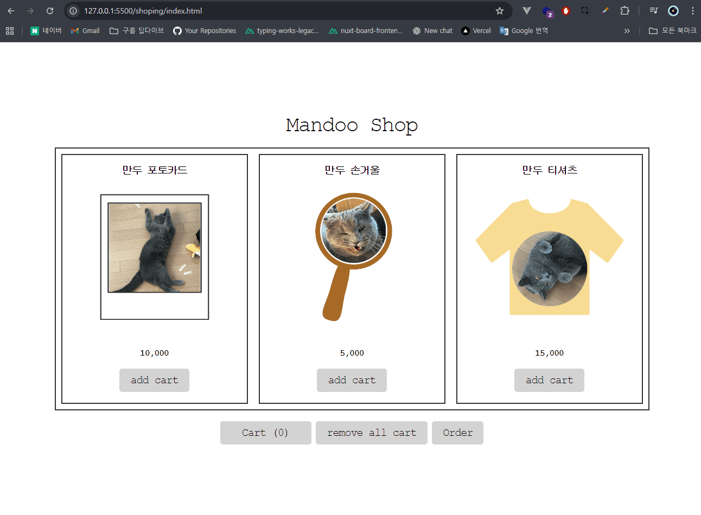

# JS_Practice_Repo(11/24)

## Mandoo Shop

# JS_Practice_Repo(11/18)

## interactiveButton.html

1. btn 클래스명을 가지고 있는 버튼을 클릭했을 때 loading 이라는 클래스명이 붙습니다.
   1. 해당 버튼을 클릭할 때 눌리는 듯한 효과가 보입니다.
   2. 해당 버튼에 loading 클래스가 붙어 있을 때 로딩 스피너가 360도 돌아갑니다.
2. 3초 뒤에 loading 이라는 클래스명이 사라집니다.
   1. 사라지면 눌리는 듯이 보였던 버튼이 다시 올라옵니다.
   2. 사라지면 로딩 스피너도 사라지고, 다시 Welcome 문구가 보입니다.

## mathCalculator.html

1. 처음 선택한 숫자가 `firstName` 에 담깁니다.
2. 두번째 선택한 숫자가 `secondName` 에 담깁니다.
3. 숫자 2개 전부 선택하지 않은 상태로 연산자 버튼을 클릭하면 `alert` 창에 `“숫자를 먼저 선택해주세요”` 라고 뜹니다.
4. 반드시 숫자 2개를 먼저 선택한 후 연산자를 클릭해야 계산이 되어 결과값을 보여줍니다.
5. 연산자 중 `/` 를 선택하면 결과값으로 `반올림`한 값을 보여줍니다.
6. 계산 후 다시 숫자를 클릭하면 `firstName` 부터 담기며 다시 시작합니다.

